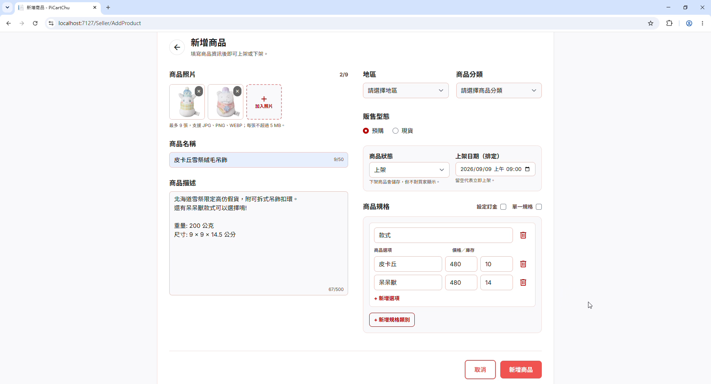
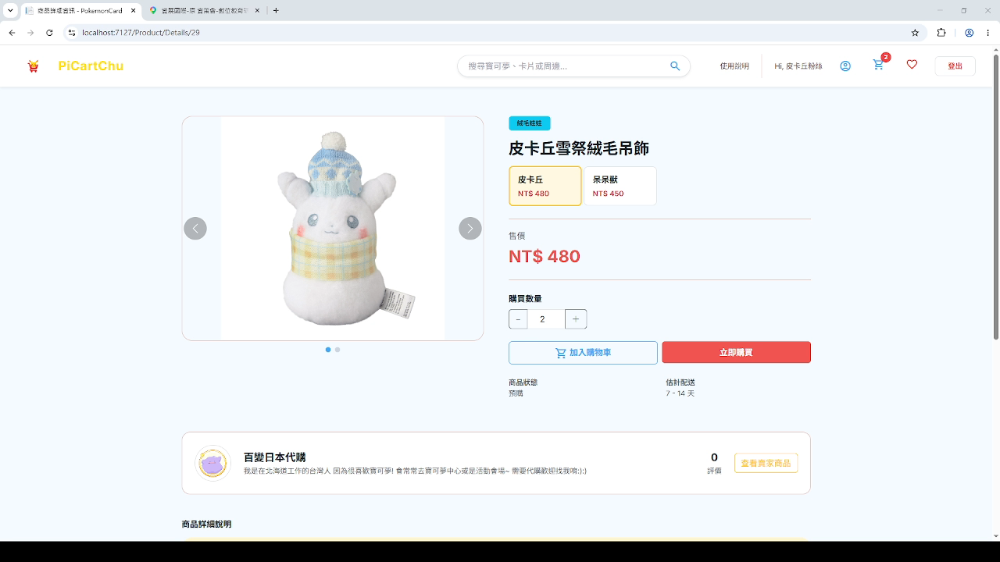
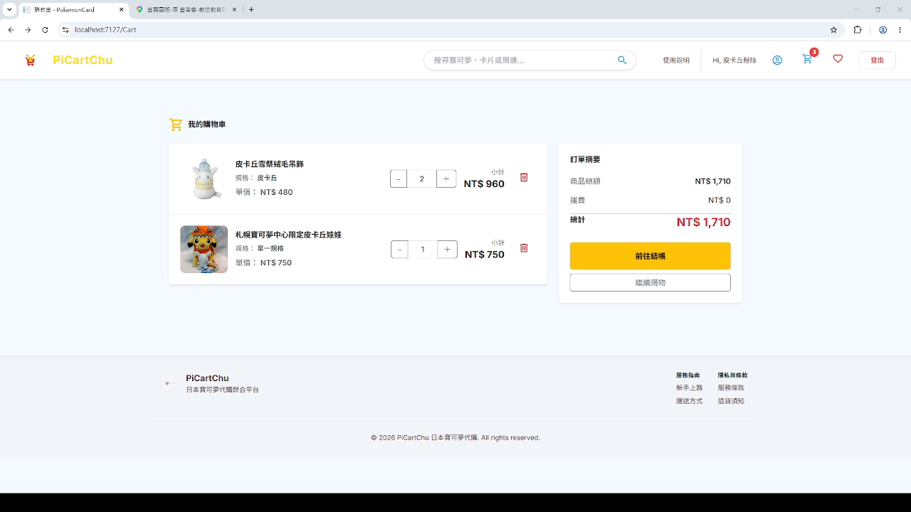
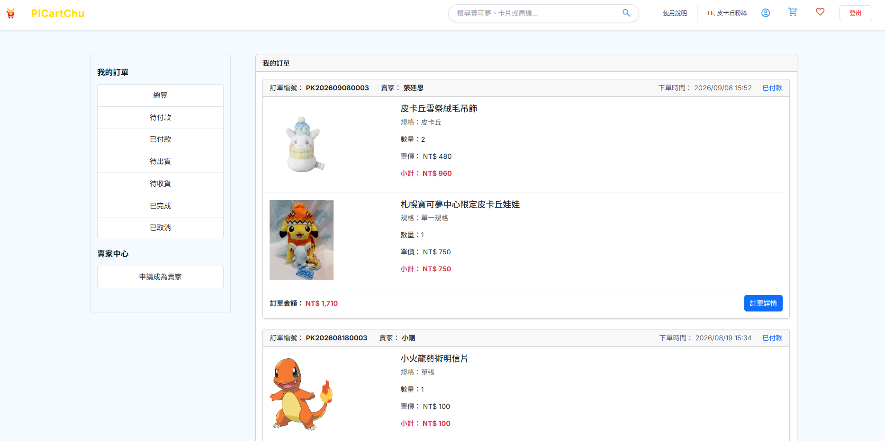
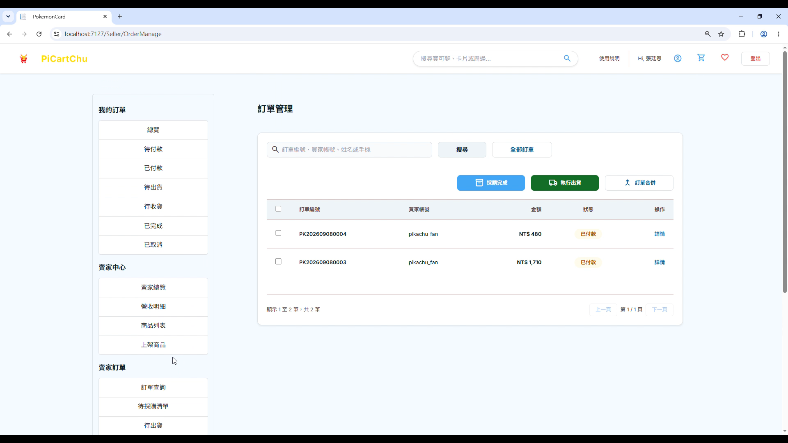
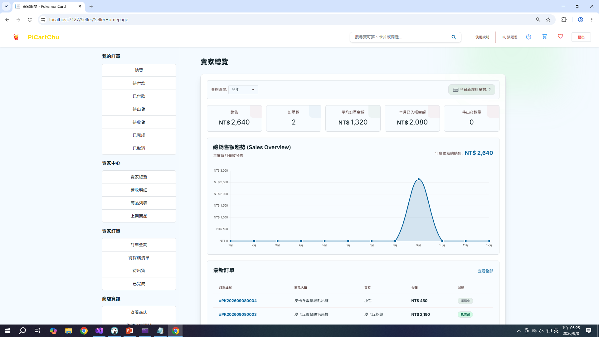
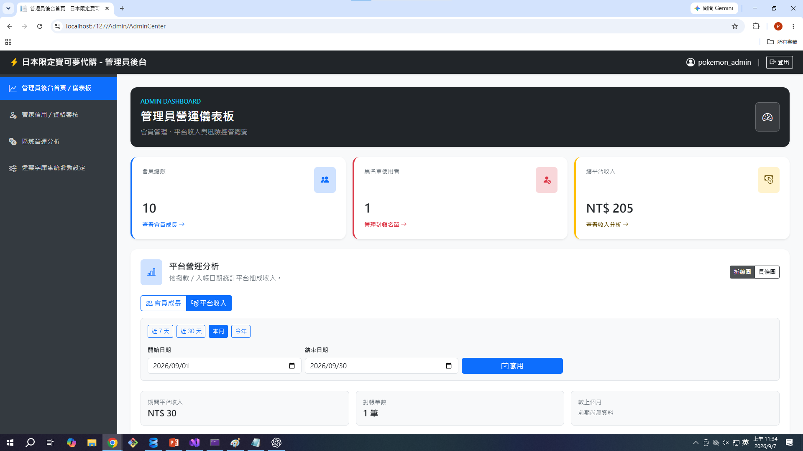
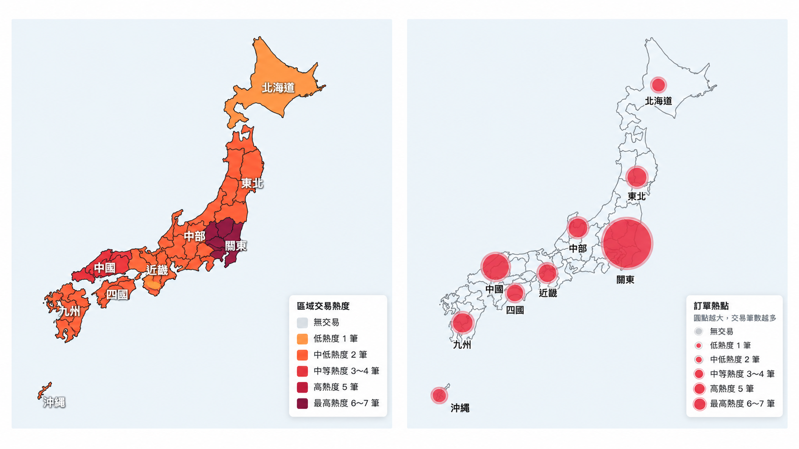

# PiCartChu 寶可夢卡牌交易平台

使用 ASP.NET Core MVC 製作的收藏卡牌電商平台，串連買家、賣家與管理員三種角色，實作從商品瀏覽、購物車、下單到後台管理的基本交易流程。

`C#` · `.NET 10` · `ASP.NET Core MVC` · `Entity Framework Core` · `SQL Server`

## 交易流程展示

以下選擇其中一項核心功能，呈現商品從賣家上架、買家瀏覽與結帳，到賣家接收訂單的完整流程。其他功能則整理於下方的功能清單。

| 1. 賣家新增並上架商品 | 2. 商品出現在買家首頁 |
| :---: | :---: |
|  |  |

| 3. 買家查看商品詳情 | 4. 加入購物車並確認金額 |
| :---: | :---: |
|  |  |

| 5. 買家完成購買並查看訂單 | 6. 賣家接收並處理訂單 |
| :---: | :---: |
|  |  |

## 賣家營運總覽



## 管理員後台

### 管理員儀表板



### 區域交易熱度比較



## 專案功能

除了上述交易流程與後台畫面外，專案亦包含以下功能：

### 買家

- 會員註冊、登入及個人資料管理
- 依關鍵字、商品類型與地區搜尋商品
- 商品規格、圖片、價格及評價展示
- 購物車、結帳、訂單查詢與確認收貨
- 線上申請成為賣家

### 賣家

- 商店資料與商品上下架管理
- 商品新增、編輯、刪除及批次操作
- 訂單搜尋、取消、合併與出貨
- 待進貨清單與營收趨勢統計

### 管理員

- 獨立的管理員登入驗證
- 會員停權與黑名單管理
- 賣家資格審核與審核紀錄
- 違禁字詞管理及文字檢測
- 平台數據與地區訂單分析

## 使用技術

| 分類 | 技術 |
| --- | --- |
| 後端 | C#、.NET 10、ASP.NET Core MVC |
| 資料存取 | Entity Framework Core、LINQ |
| 資料庫 | Microsoft SQL Server |
| 前端 | Razor Views、JavaScript、Bootstrap、Tailwind CSS |
| 圖表與地圖 | Chart.js、Leaflet |
| 驗證 | Cookie Authentication |

## 專案結構

```text
PokemonCard/
├── database/
│   └── schema.sql         # 資料庫建置腳本
├── docs/
│   ├── assets/            # README 圖片素材
│   └── screenshots/       # 專案展示畫面
├── PokemonCard/
│   ├── Controllers/       # 頁面與功能流程
│   ├── Models/            # EF Core 實體與 DbContext
│   ├── ViewModels/        # 頁面資料模型
│   ├── Views/             # Razor 頁面
│   └── wwwroot/           # CSS、JavaScript 與網站圖片
└── PokemonCard.slnx
```

## 快速開始

### 1. 環境需求

- .NET 10 SDK
- Microsoft SQL Server
- Git

### 2. 下載專案

```bash
git clone https://github.com/koi9014/PokemonCard.git
cd PokemonCard
```

### 3. 建立資料庫

使用 SQL Server Management Studio 執行 [`database/schema.sql`](./database/schema.sql)，或使用：

```bash
sqlcmd -S . -E -i database/schema.sql
```

腳本會建立 `Picartchu` 資料庫、所需資料表及本機展示管理員。若偵測到既有資料表，會停止執行以避免覆蓋資料。

請確認專案連線字串指向同一個 SQL Server 執行個體。

### 4. 啟動網站

```bash
dotnet restore PokemonCard.slnx
dotnet build PokemonCard.slnx
dotnet run --project PokemonCard/PokemonCard.csproj --launch-profile https
```

啟動後開啟 <https://localhost:7127>。

## 常用頁面

| 頁面 | 路徑 |
| --- | --- |
| 商品首頁 | `/` |
| 會員登入 | `/UserLogin/Login` |
| 購物車 | `/Cart` |
| 賣家中心 | `/Seller/SellerHomepage` |
| 管理員登入 | `/AdminLogin` |

## 注意事項

- 本專案為學習與作品展示用途，不建議直接用於正式營運。
- `schema.sql` 不包含會員、商品或訂單假資料。
- 正式部署前請更換展示管理員密碼 Hash，並妥善保管資料庫連線資訊。
- 請勿將真實會員個資或證件圖片提交至 GitHub。

## 聲明

Pokémon 及相關素材之權利屬原權利人所有。本專案為非官方學習作品，與 The Pokémon Company、Nintendo、Game Freak 或 Creatures Inc. 無關。
